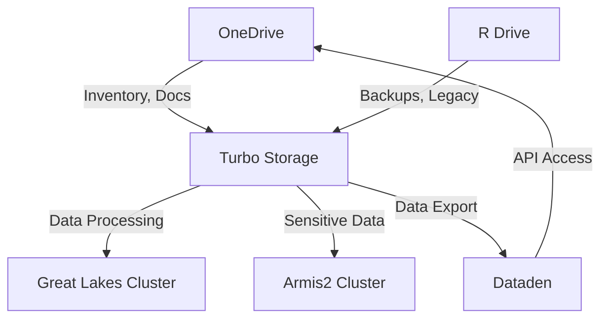
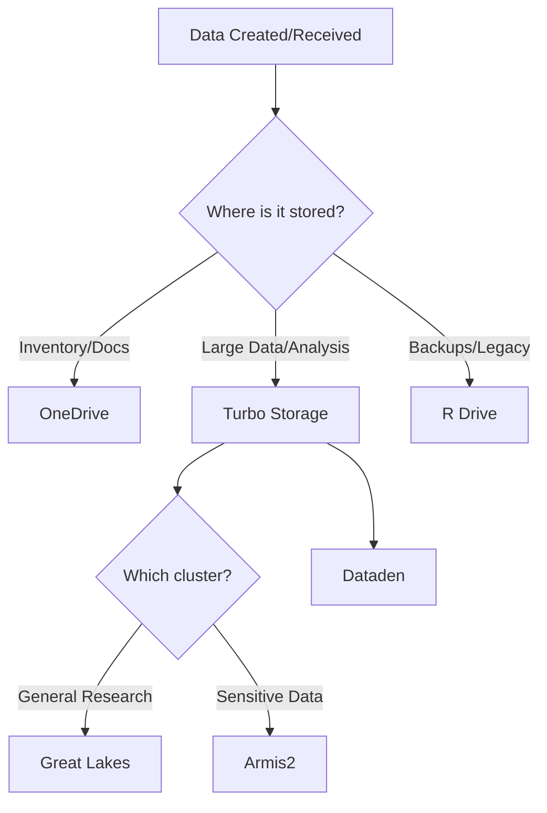
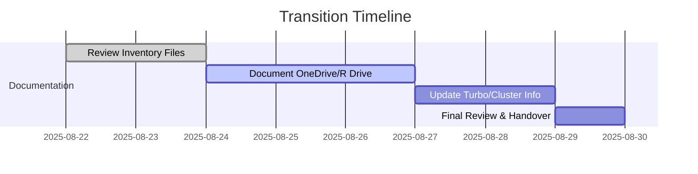

delpropo: Use the instructions in the file_location_yaml_prompt.md and the yaml file to use is mblabinfo.yaml.  Ask me if you have any questions.

GitHub Copilot: Thank you for providing both the prompt and the YAML file. Before I generate your transition guide, could you please clarify the following preferences:

1. What is your preferred output format? (Word, PDF, Markdown, or multiple formats?)
2. Do you have a preferred color scheme, branding, or logo to include?
3. Would you like specific chart types (e.g., bar charts, network diagrams), or should I choose what best fits the data?
4. Do you want interactive elements for digital viewing, or should the document be print-focused only?
5. Should I use placeholder contact information, or do you want to provide real names/emails?

Once you confirm these details, I’ll proceed to create a comprehensive, visually organized transition document as specified.

delpropo: I would like the information in markdown.  You can use mermaid for creating charts or plots so the information can easily be put on github.  Use placeholder contact information.  Format so that it can be viewed easily as a markdown file on github.

GitHub Copilot: Thank you for the details! Here’s my plan for your transition guide in Markdown, optimized for GitHub viewing:

- Professional title page (YAML metadata)
- Table of contents (with anchor links)
- Executive summary
- Logical sections with clear headings
- Tables for file/folder inventories and system comparisons
- Mermaid diagrams for architecture, flowcharts, and matrices
- Callout boxes using blockquotes and emoji/icons for visual cues
- Glossary, troubleshooting, contact placeholders, and next steps

I’ll generate the full Markdown document, including all required visual elements and formatting for GitHub. Let me know if you want any specific section order or additional customization before I proceed. Otherwise, I’ll start creating the document now.

delpropo: proceed

GitHub Copilot: I am unable to create the Markdown file directly because the target location is outside the current workspace or not open in the editor. 

To proceed, please do one of the following:
- Open your desired target folder as the workspace in VS Code, or
- Open a new or existing Markdown file in your editor where you want the content to go.

Once you do that, let me know, and I can generate the content directly into your open file. If you prefer, I can also provide the full Markdown content here for you to copy and paste. Let me know how you’d like to proceed!

delpropo: generate the information so I can paste it into a file

GitHub Copilot: Here is your comprehensive transition guide in Markdown, ready to copy and paste into a file. All diagrams use Mermaid and formatting is optimized for GitHub.

---

# MNI TEMPNAME TEMP Lab Transition Guide

---

**Lab:** mni-TEMPNAME-TEMP-lab  
**Prepared for:** Successor(s)  
**Created by:** Jim TEMP  
**Created date:** 8/22/25  
**Last updated:** 8/22/25  
**Purpose:** Documentation for position transition

---

## Table of Contents

- Executive Summary
- Storage Architecture Overview
- File Location Flowchart
- Storage Systems & Access Methods
- File & Folder Inventory
- System Comparison: Great Lakes vs. Armis2
- Transition Priorities & Matrix
- Timeline & Handover Checklist
- Glossary
- Troubleshooting
- Contact Information
- Next Steps / Action Items

---

## Executive Summary

> **:star: Critical:** The lab's inventory files and Turbo storage are essential for ongoing operations. Immediate attention is needed for "Work in progress" items in OneDrive and R Drive documentation.

This guide provides a comprehensive overview of the lab's digital resources, storage systems, and computing infrastructure. It is designed to ensure a smooth transition and continued success for the next lab manager or team member.

---

## Storage Architecture Overview

---

## File Location Flowchart

---

## Storage Systems & Access Methods

| Storage System | Location/Path | Access Method | Notes |
|---------------|---------------|--------------|-------|
| OneDrive      | OneDrive - Michigan Medicine/Documents - mni-TEMPNAME-TEMP-lab.mm | Web, Desktop Sync | Work in progress |
| R Drive       | R:\MM-MNI-TEMPLab | Network Drive | Work in progress |
| Turbo Storage | /nfs/turbo/umms-TEMPNAME | HPC Cluster Mount | Used on Great Lakes & Armis2 |
| Dataden       | umms-TEMPNAME.turbo.storage.umich.edu:/umms-TEMPNAME | Globus | For data sharing |

---

## File & Folder Inventory

### Inventory Files

| File Path | Description | Type | Access Frequency | Dependent Processes | Notes | Priority |
|-----------|-------------|------|------------------|---------------------|-------|----------|
| Documents - mni-TEMPNAME-TEMP-lab.mm/inventory/samples_and_purification.xlsx | List of samples that have been purified | Excel | Routine | Sample tracking, Purification protocols | Critical for ongoing sample management. Some samples may have been pulled and are in lab and not -80C | High |
| Documents - mni-TEMPNAME-TEMP-lab.mm/inventory/Inventory.xlsx | Complete inventory of all lab samples | Excel | Routine | Sample location tracking, Inventory management | Master inventory file - essential for lab operations | High |

### Critical Directories

| Folder Path | Description | Contents Summary | Notes | Priority |
|-------------|-------------|------------------|-------|----------|
| Documents - mni-TEMPNAME-TEMP-lab.mm/inventory/ | Contains all inventory-related files | Sample tracking, purification records, master inventory | Primary inventory management folder | High |

---

## System Comparison: Great Lakes vs. Armis2

| Feature | Great Lakes | Armis2 |
|---------|-------------|--------|
| Purpose | General HPC | Secure, HIPAA/sensitive data |
| Mount Path | /nfs/turbo/umms-TEMPNAME | /nfs/turbo/umms-TEMPNAME |
| Data Type | Research, analysis | Sensitive, regulated |
| Status | Work in progress | Work in progress |

---

## Transition Priorities & Matrix

| Item                           | Criticality | Frequency of Use | Priority |
|--------------------------------|-------------|------------------|----------|
| Inventory.xlsx                 | High        | High             | High     |
| samples_and_purification.xlsx  | High        | High             | High     |
| Turbo Storage                  | High        | Medium           | High     |
| OneDrive                       | Medium      | Medium           | Medium   |
| R Drive                        | Low         | Low              | Low      |

---
## Timeline & Handover Checklist

- [ ] Review and update all inventory files
- [ ] Complete documentation for OneDrive and R Drive
- [ ] Confirm Turbo storage and cluster access
- [ ] Finalize handover with successor

---

## Glossary

- **HPC:** High-Performance Computing
- **Turbo:** U-M high-performance storage system
- **Globus:** Data transfer tool for research computing
- **Dataden:** U-M data infrastructure for sharing datasets
- **Great Lakes:** General-purpose U-M HPC cluster
- **Armis2:** Secure U-M HPC cluster for sensitive data

---

## Troubleshooting

> **:warning: Common Issues:**
>
> - Trouble accessing Turbo storage? Check VPN and permissions.
> - OneDrive sync issues? Restart client and check login.
> - Globus transfer errors? Verify endpoint and credentials.

---

## Contact Information

- **Lab Manager:** [Name Placeholder] ([email@umich.edu])
- **IT Support:** [IT Contact Placeholder] ([it-support@umich.edu])
- **ARC Help:** https://arc.umich.edu/contact/

---

## Next Steps / Action Items

- Review and update all documentation regularly
- Ensure backups are current and accessible
- Schedule periodic access reviews for all storage systems
- Provide feedback and suggestions for future improvements

---

> **:memo: Note:** This document is a living resource. Update as needed to reflect changes in lab infrastructure or personnel.

---